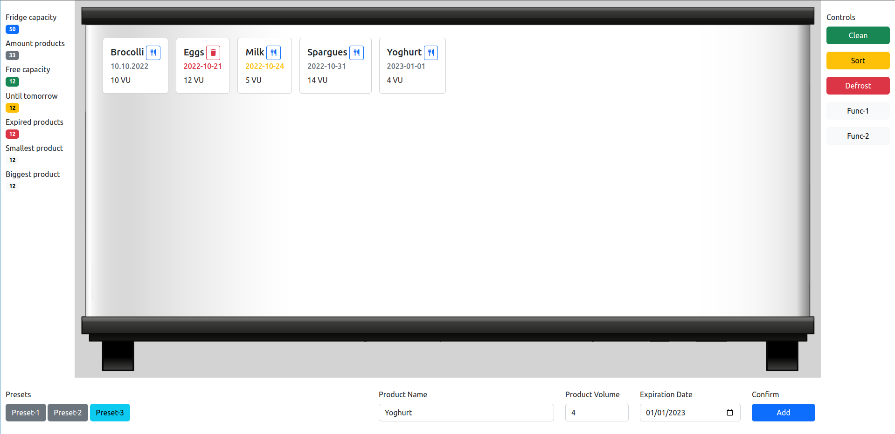

# PB-Abschlussprojekt: Kühlschrank-Management-App

## Einleitung
Dies ist das Abschlussprojekt für das Programming-Basics Modul.
Es enthält neben dieser README, die die Aufgabe beschreibt, noch einige zusätzliche Ordner.

### Vorgegebene Dateistruktur
- `src/` -> Dieser Ordner enthält den gesamten Code des Projekts. Dazu gehören
    - `index.html` -> Die HTML-Datei, die das gesamte Markup der GUI enhält.
    - `css/` -> In diesem Ordner befindet sich alles nötige CSS für die GUI.
    - `img/` -> In diesem Ordner befinden sich alle für die GUI nötigen Bild-Dateien.
    - `js/` -> Der Ordner für alle Javascript-Dateien:
        - `main.js` -> Die haupt Javascript Datei, die bereits einigen hilfreichen Code enthält und für die Regelung aller Nutzer-Interaktionen auf der GUI enthalten soll.
        - `fridge.js` -> Eine extra-Datei für die benötigte Kühlschrank-Klasse, die für die Datenstruktur benötigt wird.
        - `product.js` -> Eine extra-Datei für die benötigte Produkt-Klasse, die für die Datenstruktur benötigt wird.
- `docs/` -> Dieser Ordner dient als Ablageort aller nötigen Dokumentationsdateien.
- `.gitignore` -> Diese Datei wird von `git` ausgewertet. `git` ignoriert alle darin enthaltenen Dateien und Ordner.

## Projektbeschreibung
Das folgende Bild zeigt einen Screenshot der GUI für die Kühlschrank-Management-App.

### Spezifikationen
#### **Die GUI**
Die Nutzoberfläche wurde mit Bootstrap erstellt und lässt sich in **vier** grobe Teile unterteilen:
- In der **linken Spalte** befindet sich der Info-Bereich. Dieser zeigt einige Kennzahlen des verwalteten Kühlschranks an. Dazu zählen die gesamte Kühlschrankkapazität, die Anzahl der im Kühlschrank eingelagerten Produkte, die noch freie Kapazität, die Anzahl der Produkte, die am nächsten Tag ablaufen, die Anzahl der abgelaufenen Produkte, das Volumen des kleinsten Produkts und das Volumen des größten Produkts.

- Die **rechte Spalte** dient als Kontrollpult des Kühlschrank. Sie beinhaltet Knöpfe zum Ausführen verschiedener Funktionen des Kühlschranks. Dazu zählen:
    - Clean -> Diese Funktion soll alle abgelaufenen Produkte aus dem Kühlschrank entfernen.
    - Sort -> Diese Funktion sortiert den Inhalt des Kühlschranks in aufsteigender Richtung nach dem Verfallsdatum der Produkte.
    - Defrost -> Diese Funktion entfernt alle Produkte aus dem Kühlschrank.
    - Func-1 -> Dieser Knopf ist frei-programmierbar für weitere Funktionalität.
    - Func-2 -> Dieser Knopf ist frei-programmierbar für weitere Funktionalität.

- Die **mittlere Spalte** stellt den Kühlschrank mit den eingelagerten Produkten dar. Darin werden die Produkte als Kacheln mit den wichtigsten Informationen und einem Löschknopf hinterlegt.

- Der **untere Bereich** besteht aus einer Hinzufüge-Maske für neue einzulagernde Produkte sowie einem Preset-Bereich, wo sich Voreinstellungen für die Eingabemaske auf die Knöpfe hinterlegen lassen.

#### **Die Datenstruktur**
Zur internen Abbildung der Daten soll eine Klassenbasierte Datenstruktur erstellt werden.  

Um den **Kühlschrank** abzubilden soll die Klasse `Fridge` aus `src/js/fridge.js` genutzt werden.  
Die Klasse sollte im Konstruktor eine `capacity` als Ganzzahl entgegen nehmen und diese der Instanz zuordenen.  
Zusätzlich benötigt die Klasse ein Datenfeld zur Speicherung der im Kühlschrank enthaltenen Produkte.
Hierfür würde sich zunächst ein Array anbieten.

Um die einzelnen eingelagerten **Produkte** abzubilden, soll die Klasse `Product` aus `src/js/product.js` genutzt werden.  
Die Klasse sollte über den Konstruktor folgende Daten entgegen nehmen und der Instanz zuordnen:
- Den Namen des Produkts als String
- Das Volumen des Produkts als Ganzzahl
- Das Ablaufdatum des Produkts als Datum

Zur Vereinfachung wird als Einheit für das Volumen die imaginäre Einheit `VU` genutzt.

Beim Anlegen neuer Produkte soll nun also eine neue Instanz der Klasse `Product` entstehen und, falls im Kühlschrank noch genug freies Volumen dafür übrig ist, zu dem Array in der Instanz der Klasse `Fridge` eingespeichert werden.

#### **Benötigte Funktionalität**
Für die Verwaltung der Produkte im Kühlschrank werden einige Funktionen erwartet:
- Das Hinzufügen neuer Produkte, wofür das Formular im **unteren Bereich der GUI** verwendet wird.
- Das Entfernen einzelner bereits eingelagerter Produkte, wofür der Löschknopf auf den **Produkt-Kacheln in der mittleren Spalte** verwendet wird.
- Das Entfernen aller bereits abgelaufener Produkte, wofür der `Clean`-Knopf in **der rechten Spalte** der GUI verwendet wird.
- Das Sortieren aller Produkte nach Ablaufdatum in aufsteigender Reihenfolge (also ältestes Datum zuerst), wofür der `Sort`-Knopf in **der rechten Spalte** der GUI verwendet wird.
- Das Entfernen ALLER eingelagerten Produkte, wofür der `Defrost`-Knopf in **der rechten Spalte** der GUI verwendet wird.

**BONUS**: Eventuell möchte man einige Voreinstellungen zum Hinzufügen von Produkten haben, die per Knopfdruck vorgefertigte Werte für `Name` und `Volume` in die Maske eintragen, so dass nurnoch ein Ablaufdatum händisch hinzugefügt werden soll.

Für die Überwachung des Kühlschrank Status sind einige Anzeigewerte **in der linken Spalte** der GUI vorgesehen:
- Die Gesamtkapazität des Kühlschranks, also das in der Kühlschrank-Instanz hinterlegte Gesamtvolumen (`Fridge capacity`).
- Die Anzahl der bereits eingelagerten Produkte (`Amount products`).
- Die freie Kapazität des Kühlschranks, also wieviel Volumen im Kühlschrank noch frei ist (`Free capacity`).
- Die Anzahl der Produkte, die in einem Tag verfallen (`Until tomorrow`).
- Die Anzahl der Produkte, die bereits abgelaufen sind (`Expired Products`).
- Das Volumen des kleinsten Produkts, also das Produkt mit dem kleinsten Volumen (`Smallest product`).
- Das Volumen des größten Produkts, also das Produkt mit dem größten Volumen (`Biggest product`).

